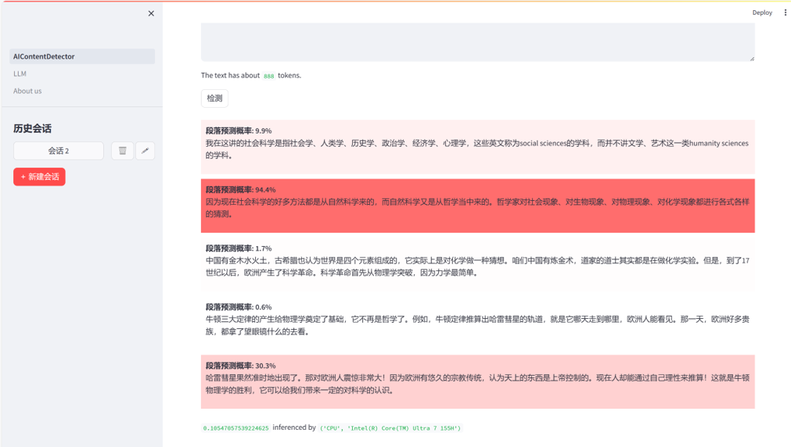
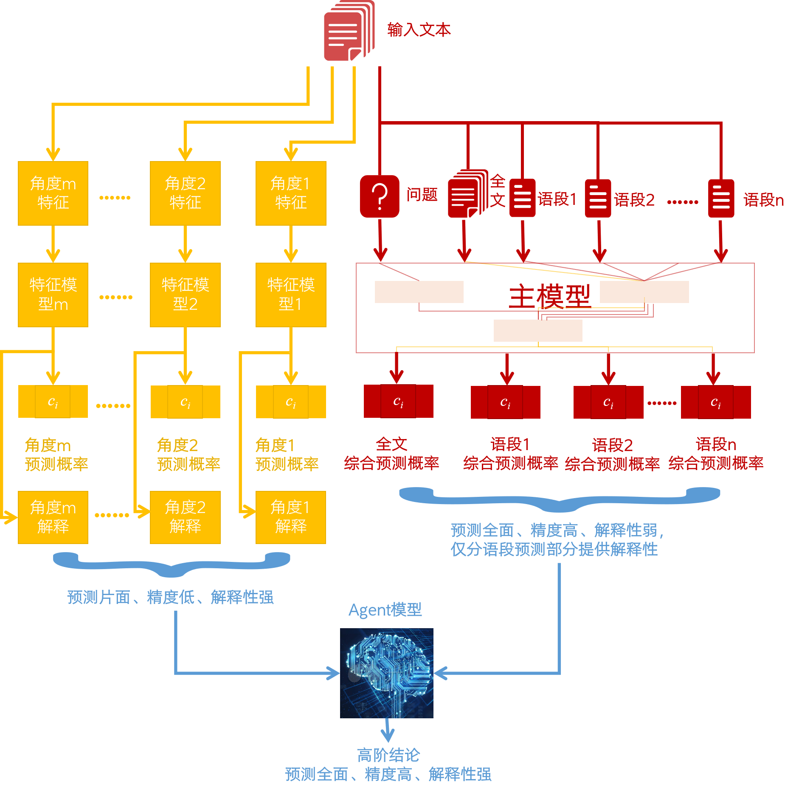
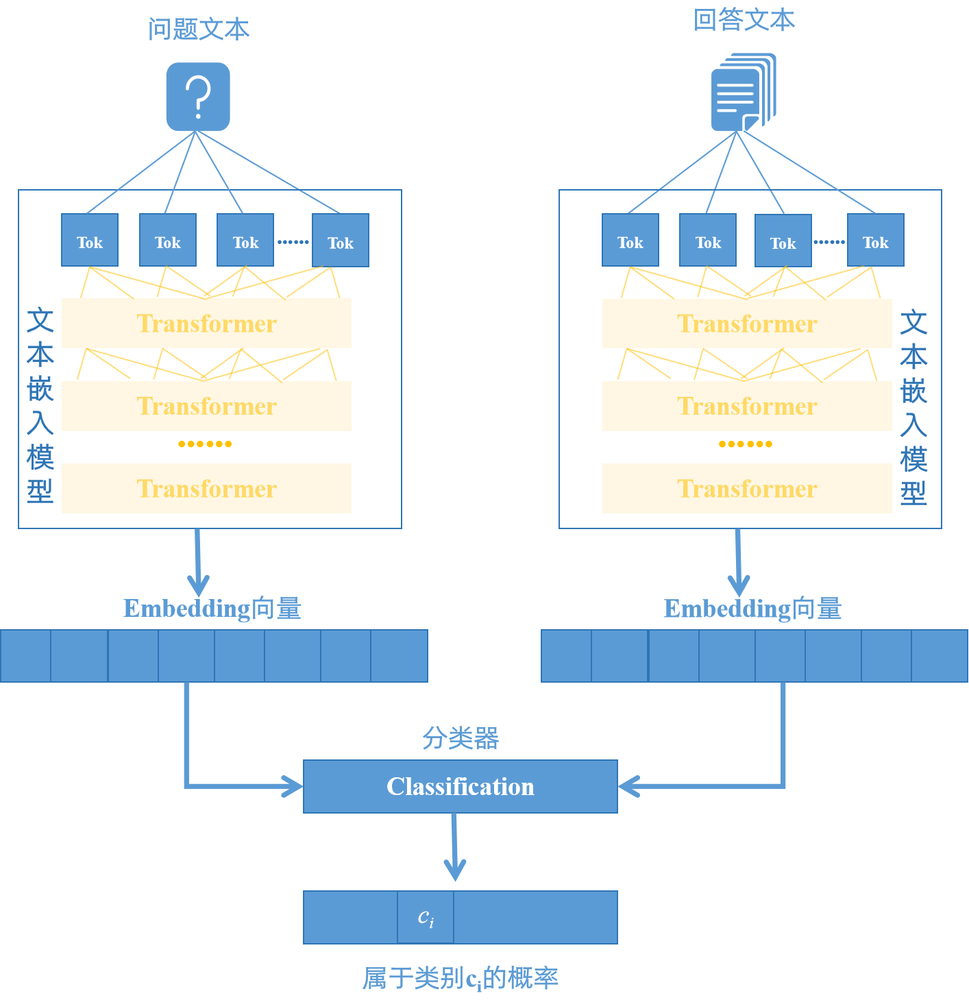
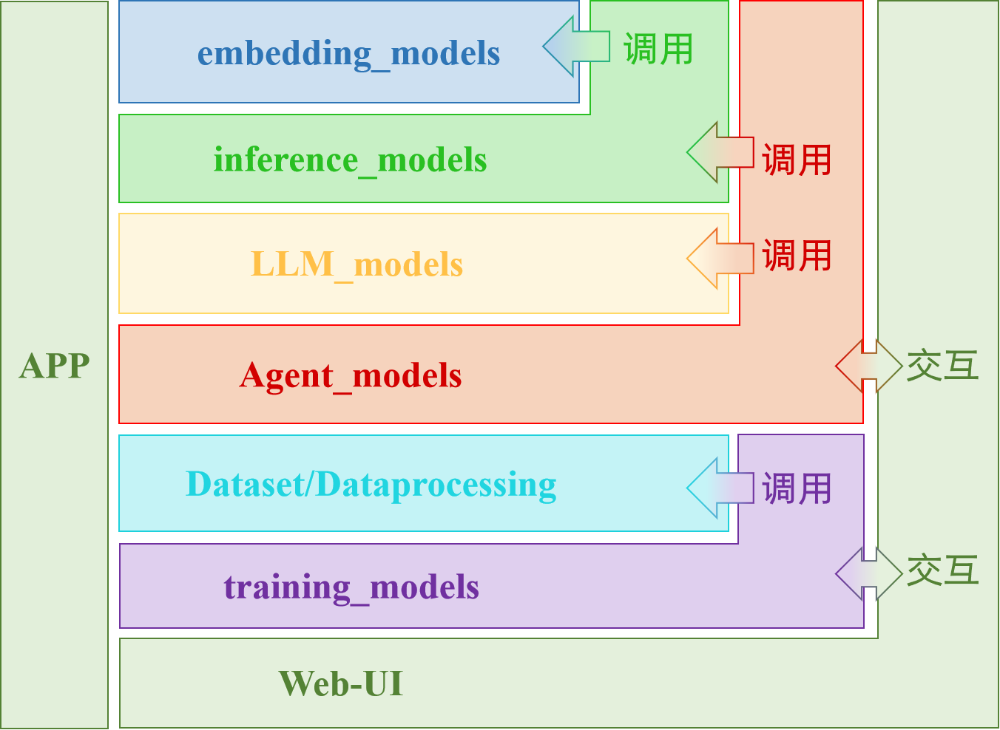

# llmFlight with WebUI

**For all datasets please visit https://huggingface.co/datasets/xuanfl/datasets-for-llmFlight/tree/main .**  
**更多数据集请参见 https://huggingface.co/datasets/xuanfl/datasets-for-llmFlight/tree/main 。**  

**For all model and its params please visit https://huggingface.co/xuanfl/llmFlight/tree/main and you can also upload your model or params there. Thank you for your support.**  
**如需下载更多模型及其参数，请访问 https://huggingface.co/xuanfl/llmFlight/tree/main ，您也可以在那里上传您开发、训练的模型或参数。感谢您的支持。**  

**Scripts contains utility modules such as arkDLtools, which has been released to PyPi and has powerful features such as instant visualization of the training process (highly customizable), see [README.md](https://github.com/arkhubs/llmFlight/tree/main/Scripts/arkDLtools) in `Scripts/arkDLtools` for details.**  
**Scripts中包含一些实用模块，比如已发布到PyPi的arkDLtools，具有即时性地可视化训练过程（高度自定义）等强大功能，详见`Scripts/arkDLtools`中的[README.md](https://github.com/arkhubs/llmFlight/tree/main/Scripts/arkDLtools)**  

&ensp;&ensp; This is the code implementation of the Interpretable Language Style Recognition Framework developed by our team, with great compatibility and extensibility, comes with a WebUI, and supports custom plug-ins, similar to Stable Diffusion. It can realize sub-segment prediction and full-text prediction, and also give multi-dimensional prediction probabilities from different perspectives (e.g. word usage, sentence style, emotional trend, emotional polarity, etc.), combined with Agent modeling, semi-automatic and interactive decision-making. We have currently implemented ChatGPT Gnerated Text Detection(Acurracy 99%) and Luxin Text Detection. To realize more interesting applications, you just need to use your own dataset to train directly, the model compatibility is very strong; of course, you can also develop your own model, put it into the corresponding directory, the WebUI can automatically detect and for you to choose.

&emsp;&emsp; 这是我们团队自主研发的可解释语言风格辨识框架的代码实现，兼容性和扩展性极强，附带Web用户界面，支持自定义插件，类似于Stable Diffusion那样。它可以实现分语段预测与全文预测，还能从不同角度（如用词、句式、情感趋势、情感极性等）给出多维预测概率，结合Agent模型，半自动、可交互式决策。我们目前已经实现了CharGPT文本检测（准确率99%）和鲁讯文本检测。要想实现更多有趣的应用，您只需使用您自己的数据集直接训练即可，模型的兼容性非常强；当然，您也完全可以开发自己的模型，放进对应目录，WebUI即可自动检测到并供您选择。

The entire APP catalog contains 7 main directories:
- `embedding_models` holds different text embedding models;
- `inference_models` holds the different inference models, including the main model and the specialization model, which are called during the inference process
- `LLM_models` holds large language models, which is relatively independent from the previous two directories;
- `Agent_models` holds the Agent model, which serves to analyze the numerous results given by the inference model and intelligently assist the user in decision making, a process that may require the use of natural language, so it will call the inference model in `inference_models` and the large language model in `LLM_models`;
- `Dataset` holds the dataset and the modules required for data processing and invocation, which the user interacts with only when training the model himself, and not during the inference process;
- `Scripts` provides other plugins, such as interface for users to train with customized datasets;  
- `WebUI` houses the modules needed to start and run the user interface, interacts directly with the user in the front-end, interacts with the Agent models in `Agent_models` in the back-end, and also interacts with `Scripts`, which facilitates the user to visually train a new model using the customized dataset; in addition, it also has the authority to manage the privileges of the whole APP.

整个APP目录内包含7个主要目录：
- `embedding_models`中存放不同的文本嵌入模型；
- `inference_models`中存放不同的推理模型，包括主模型和特化模型，它们在推理过程中会调用
- `LLM_models`中存放大型语言模型，它与前面两个目录相对独立；
- `Agent_models`中存放Agent模型，它的作用是分析推理模型给出的众多结果，智能地辅助用户进行决策，这个过程可能需要使用自然语言，因此它会调用`inference_models`中的推理模型和`LLM_models`中的大型语言模型；
- `Dataset`中存放数据集和数据处理、调用所需模块，用户只有在自己训练模型时才会与之交互，在推理过程中不与之交互；
- `Scripts`中提供额外、可自定义的插件，包括用户使用自定义的数据集进行训练的接口；
- `WebUI` 中存放启动、运行用户界面所需的模块，在前端直接与用户交互，在后端与`Agent_models`中的Agent模型交互，同时也与`Scripts`交互，方便用户可视化地使用自定义数据集训练新的模型；另外，它也拥有管理整个APP的权限。
